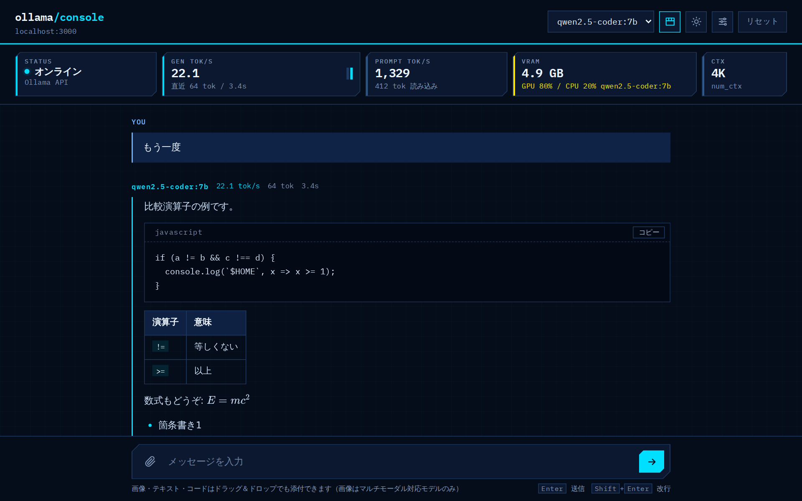

# ollama/console

ローカルの [Ollama](https://ollama.com/) で動かしているモデルと、ブラウザからチャットするためのWeb UIです。
生成速度（tok/s）やVRAMの使用状況をリアルタイムに見ながら会話できる、「自宅LLMサーバーの管理コンソール」をイメージして作りました。



- Node.js の標準モジュールだけで動作（`npm install` 不要）
- 必要なファイルは `server.js` と `index.html` の2つだけ
- ダーク / ライトテーマ、スマホ表示に対応

## 主な機能

### サーバーの状態表示

画面上部のステータスバーに、次の情報を常に表示します。

| 項目 | 内容 |
|---|---|
| STATUS | Ollama との接続状態 |
| GEN TOK/S | 生成速度。生成中は概算値をリアルタイムに表示し、完了時に Ollama が返す `eval_count` / `eval_duration` から正確な値に切り替わります。直近16回分の推移をミニグラフで表示します |
| PROMPT TOK/S | 入力（プロンプト）の読み込み速度 |
| VRAM | `/api/ps` から取得した、読み込み中モデルのVRAM使用量と GPU / CPU の割合。VRAMに収まらずCPUに溢れている場合は黄色で警告します |
| CTX | 現在のコンテキストウィンドウ（`num_ctx`） |

ステータスバーはヘッダーのボタンで折りたためます。折りたたみ中はヘッダーに接続状態と生成速度だけを小さく表示します。生成中はヘッダー下の区切り線に光が流れます。

各回答の見出しにも、その回答の生成速度・トークン数・所要時間を表示します。

### チャット

- ストリーミング表示と、生成途中での停止
- Markdown 表示（表・リスト・見出しなど）と、KaTeX による数式表示（`$...$` / `$$...$$`）
- コードブロックに言語名とコピーボタンを表示。リガチャのないフォントを使っているので、`!=` や `>=` がそのまま表示されます
- 画像の添付（マルチモーダル対応モデルのみ）と、テキスト・コードファイルの添付。ドラッグ＆ドロップにも対応しています
- モデルの切り替え（`/api/tags` からインストール済みのモデルを取得）

### 設定

設定はブラウザの localStorage に保存されます。

- **コンテキストウィンドウ**: 2K〜128K から選択
- **思考モード（Thinking）**: 対応モデル（DeepSeek-R1、Qwen3 など）で思考過程を折りたたみ表示します
- **オーケストレーションモード**: 複数の「下書きAI」が順番に回答を作り、「推敲AI」がそれらをまとめて最終回答を出します。下書きAIの数は1〜4から選べます

## 必要なもの

- [Ollama](https://ollama.com/)（1つ以上のモデルを `ollama pull` 済みであること）
- [Node.js](https://nodejs.org/)

## 使い方

1. Ollama を起動します。

   ```bash
   ollama serve
   ```

2. モデルがまだなければダウンロードします（例）。

   ```bash
   ollama pull qwen2.5-coder:3b
   ```

3. `server.js` と `index.html` を同じフォルダに置いて、サーバーを起動します。

   ```bash
   node server.js
   ```

4. ブラウザで `http://localhost:3000` を開きます。

`Enter` で送信、`Shift` + `Enter` で改行です。

## 構成

```
ブラウザ ──> server.js (:3000) ──> Ollama (127.0.0.1:11434)
             ├ /            … index.html などの静的ファイルを配信
             └ /ollama/*    … Ollama API へのプロキシ
```

ポート番号や Ollama の接続先は `server.js` 冒頭の `PORT` / `OLLAMA_HOST` / `OLLAMA_PORT` で変更できます。

## セキュリティについて

`server.js` には次の対策を入れています。

- **Ollama API のホワイトリスト**: プロキシを通せるのは `/api/chat`・`/api/generate`・`/api/tags`・`/api/show`・`/api/ps`・`/api/embed`・`/api/embeddings` だけです。モデルの削除（`/api/delete`）やダウンロード（`/api/pull`）などの操作は外部から実行できません
- **静的ファイル配信の制限**: パストラバーサル対策を二重に行い、許可した拡張子のファイルだけを配信します。`server.js` 自身とドットファイル（`.env` など）は配信しません
- **アクセスログ**: `logs/access-YYYY-MM-DD.log` に、アクセス元IP・日時・URL・ステータス・処理時間を記録します。チャットの内容は記録しません

> [!WARNING]
> このサーバーには**認証機能がありません**。ngrok などでインターネットに公開すると、URLを知っている人は誰でもあなたのPCでモデルを動かせます。外部に公開する場合は、ngrok の Basic 認証などを必ず併用してください。
>
> ```bash
> ngrok http 3000 --basic-auth "user:password"
> ```
>
> また、`logs/` フォルダにはアクセス元のIPアドレスが記録されるため、リポジトリなどで公開しないよう注意してください。

## 注意事項

- フォント（Google Fonts）、[marked](https://github.com/markedjs/marked)、[KaTeX](https://katex.org/) はCDNから読み込んでいます。オフライン環境ではフォントが代替のものになり、Markdown と数式が正しく表示されません
- 表示される生成速度は Ollama が返す計測値にもとづいています。生成中の値は「1チャンク ≒ 1トークン」とみなした概算です

## ライセンス

MIT License
